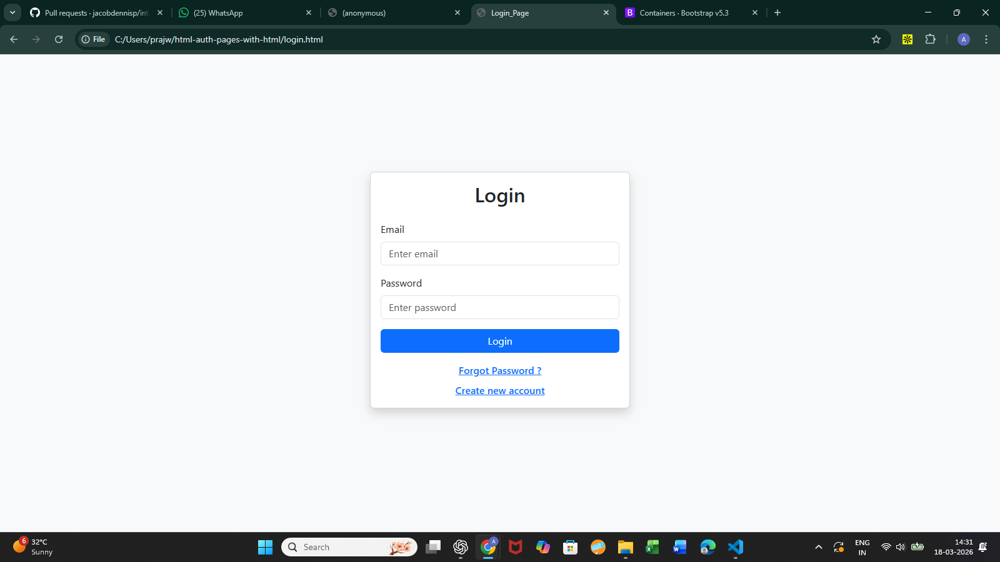
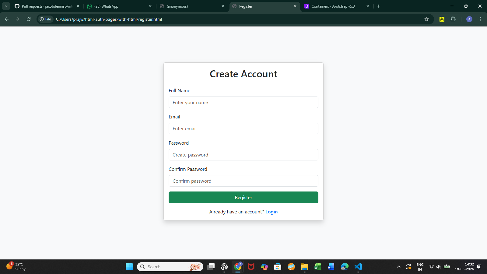
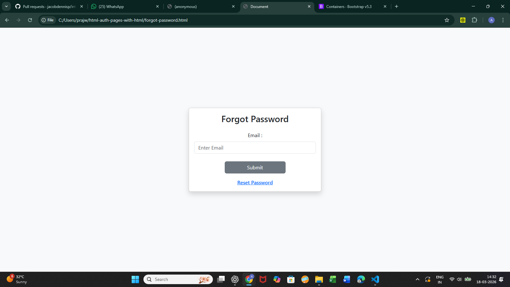
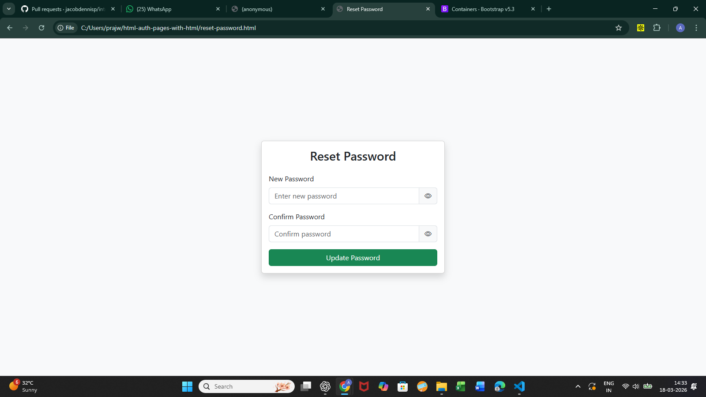
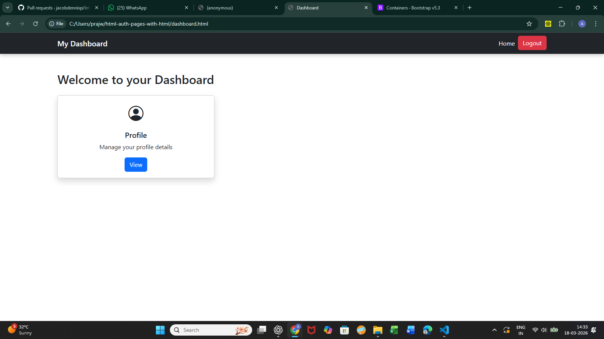

# HTML Authentication Pages

A simple authentication UI project built using **HTML** that includes complete user authentication page designs such as Login, Register, Password Reset, and Dashboard.

This project focuses on building clean and structured authentication interfaces using pure HTML.

---

##  Features

-  Login Page
-  Registration Page
-  Forgot Password Page
-  Reset Password Page
-  Dashboard Page
-  Clean and structured UI layout
-  Beginner-friendly project structure

---

##  Project Structure

html-auth-pages-with-html/
│
├── login.html
├── register.html
├── forgot-password.html
├── reset-password.html
├── dashboard.html
└── README.md

## Screenshots of UI

### Login Page

### Registration Page

### Forgot Password Page

### Reset Password Page

### Dashboard Page

##  Author

**Akash Nelwade**

- GitHub: https://github.com/akashnelwade
- LinkedIn: https://www.linkedin.com/in/nelwade-akash

